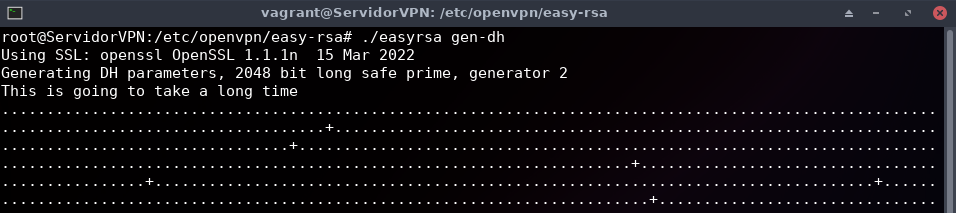
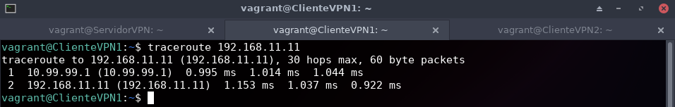

# **Práctica: Redes Privadas Virtuales**

**Tabla de contenidos:**

- [**Práctica: Redes Privadas Virtuales**](#práctica-redes-privadas-virtuales)
  - [**A) VPN de acceso remoto con OpenVPN y certificados x509 (5 puntos)**](#a-vpn-de-acceso-remoto-con-openvpn-y-certificados-x509-5-puntos)
  - [**B) VPN sitio a sitio con OpenVPN y certificados x509 (10 puntos)**](#b-vpn-sitio-a-sitio-con-openvpn-y-certificados-x509-10-puntos)
  - [**C) VPN de acceso remoto con WireGuard (5 puntos)**](#c-vpn-de-acceso-remoto-con-wireguard-5-puntos)
  - [**D) VPN sitio a sitio con WireGuard (10 puntos)**](#d-vpn-sitio-a-sitio-con-wireguard-10-puntos)
  - [**Realización**](#realización)
    - [**Tarea A**](#tarea-a)
    - [**Tarea B**](#tarea-b)
    - [**Tarea C**](#tarea-c)
    - [**Tarea D**](#tarea-d)

---

## **A) VPN de acceso remoto con OpenVPN y certificados x509 (5 puntos)**

Configura una conexión VPN de acceso remoto entre dos equipos del cloud:

- Uno de los dos equipos (el que actuará como servidor) estará conectado a dos redes:
  - Para la autenticación de los extremos se usarán obligatoriamente certificados digitales, que se generarán utilizando openssl y se almacenarán en el directorio /etc/openvpn, junto con  los parámetros Diffie-Helman y el certificado de la propia Autoridad de Certificación.
  - Se utilizarán direcciones de la red 10.99.99.0/24 para las direcciones virtuales de la VPN. La dirección 10.99.99.1 se asignará al servidor VPN.
  - Los ficheros de configuración del servidor y del cliente se crearán en el directorio /etc/openvpn de cada máquina, y se llamarán servidor.conf y cliente.conf respectivamente.
  - Tras el establecimiento de la VPN, la máquina cliente debe ser capaz de acceder a una máquina que esté en la otra red a la que está conectado el servidor.
- Documenta el proceso detalladamente.

---

## **B) VPN sitio a sitio con OpenVPN y certificados x509 (10 puntos)**

Configura una conexión VPN sitio a sitio entre dos equipos del cloud:

- Cada equipo estará conectado a dos redes, una de ellas en común:
  - Para la autenticación de los extremos se usarán obligatoriamente certificados digitales, que se generarán utilizando openssl y se almacenarán en el directorio /etc/openvpn, junto con con los parámetros Diffie-Helman y el certificado de la propia Autoridad de Certificación.
  - Se utilizarán direcciones de la red 10.99.99.0/24 para las direcciones virtuales de la VPN.
  - Tras el establecimiento de la VPN, una máquina de cada red detrás de cada servidor VPN debe ser capaz de acceder a una máquina del otro extremo.
- Documenta el proceso detalladamente.

---

## **C) VPN de acceso remoto con WireGuard (5 puntos)**

Monta una VPN de acceso remoto usando Wireguard. Intenta probarla con clientes Windows, Linux y Android. Documenta el proceso adecuadamente y compáralo con el del apartado A.

---

## **D) VPN sitio a sitio con WireGuard (10 puntos)**

Configura una VPN sitio a sitio usando WireGuard. Documenta el proceso adecuadamente y compáralo con el del apartado B.

---

## **Realización**

### **Tarea A**

**A) VPN de acceso remoto con OpenVPN y certificados x509 (5 puntos)**

Para preparar el escenario usaré Vagrant. Las máquinas que usaré serán:

- **Servidor VPN - Debian 11 (Bullseye)**
- **Cliente 1 VPN - Debian 11 (Bullseye)**
- **Cliente 2 VPN - Debian 11 (Bullseye)**

El **fichero Vagrantfile** que usaré es el siguiente:

```ruby
Vagrant.configure("2") do |config|
    config.vm.provider :libvirt do |libvirt|
        libvirt.memory = 1024
    end
    config.vm.define :nodo1 do |nodo1|
      nodo1.vm.box = "debian/bullseye64"
      nodo1.vm.hostname = "ServidorVPN"
      nodo1.vm.synced_folder ".", "/vagrant", disabled: true
      nodo1.vm.network :private_network,
        :libvirt__network_name => "VPN1",
        :libvirt__dhcp_enabled => false,
        :ip => "192.168.10.10",
        :mode => "veryisolated"
      nodo1.vm.network :private_network,
        :libvirt__network_name => "VPN2",
        :libvirt__dhcp_enabled => false,
        :ip => "192.168.11.10",
        :libvirt__forward_mode => "veryisolated"
    end
    config.vm.define :nodo2 do |nodo2|
      nodo2.vm.synced_folder ".", "/vagrant", disabled: true
      nodo2.vm.box = "debian/bullseye64"
      nodo2.vm.hostname = "ClienteVPN1"
      nodo2.vm.network :private_network,
        :libvirt__network_name => "VPN1",
        :libvirt__dhcp_enabled => false,
        :ip => "192.168.10.11",
        :libvirt__forward_mode => "veryisolated"
    end
    config.vm.define :nodo3 do |nodo3|
      nodo3.vm.synced_folder ".", "/vagrant", disabled: true
      nodo3.vm.box = "debian/bullseye64"
      nodo3.vm.hostname = "ClienteVPN2"
      nodo3.vm.network :private_network,
        :libvirt__network_name => "VPN2",
        :libvirt__dhcp_enabled => false,
        :ip => "192.168.11.11",
        :libvirt__forward_mode => "veryisolated"
    end
end
```

Tras crear el archivo, ejecuto vagrant para crear e iniciar las máquinas virtuales:

```bash
vagrant up --provider=libvirt
```


Cuando acaben de crearse, **me conecto a la máquina que hará de servidor VPN**, instalo openvpn y activo su bit de forwarding de forma permanente:

```bash
vagrant ssh nodo1

sudo apt update

sudo apt install openvpn -y

sudo nano /etc/sysctl.conf
```

Descomento la línea `net.ipv4.ip_forward=1` y guardo el fichero. Activo los cambios de forma inmediata:

```bash
sudo sysctl -p
```


Continúo copiando la carpeta */usr/share/easy-rsa* a */etc/openvpn/*:

```bash
sudo cp -r /usr/share/easy-rsa /etc/openvpn/
```

Me ubico en la carpeta */etc/openvpn/easy-rsa/* e inicio el entorno PKI (Public Key Infrastructure) de Easy-RSA::

```bash
cd /etc/openvpn/easy-rsa/

sudo su

./easyrsa init-pki
```

Tras esto, genero el certificado de la Autoridad de Certificación (CA):

```bash
./easyrsa build-ca
```


El certificado se ha generado en */etc/openvpn/easy-rsa/pki/ca.crt*.

A continuación, genero los parámetros [Diffie-Helman](https://www.youtube.com/watch?v=NmM9HA2MQGI), esto tardará un poco:

```bash
./easyrsa gen-dh
```




Estos se generan en */etc/openvpn/easy-rsa/pki/dh.pem*.

Prosigo generando el certificado y clave privada del servido (Open)VPN. Usaré el parámetro *nopass* para que no me solicite añadir una contraseña, podría haberlo usado antes cuando generé el certificado de la CA pero no lo hice para ilustrar ambos casos:

```bash
./easyrsa build-server-full server nopass
```


Los archivos generados serán:

- */etc/openvpn/easy-rsa/pki/issued/server.crt*
- */etc/openvpn/easy-rsa/pki/private/server.key*


Hecha esta configuración para el servidor, creo un certificado y clave privada para el cliente 1 (nodo2), que será el que estará en la red *externa* y se conectará por la VPN.

```bash
./easyrsa build-client-full ClienteVPN1 nopass
```


Tras crear los *crt* y *key* del cliente, los envío a dicho cliente para que pueda conectarse a la VPN más tarde. Antes de hacer esto, creo un directorio para almacenar los certificados y claves que vaya generando:

```bash
mkdir -p /etc/openvpn/clientes/ClienteVPN1

cp -rp /etc/openvpn/easy-rsa/pki/{ca.crt,issued/ClienteVPN1.crt,private/ClienteVPN1.key} /etc/openvpn/clientes/ClienteVPN1/
```


Ahora en el servidor creo un par de claves ssh y las coloco en el authorized_keys del cliente para poder enviar los certificados y claves de forma segura:

```bash
ssh-keygen -b 4096

cat ~/.ssh/id_rsa.pub
```

Copio los ficheros *ca.crt*, *ClienteVPN1.crt* y *ClienteVPN1.key* al cliente (nodo2):

```bash
scp -r /etc/openvpn/easy-rsa/pki/{ca.crt,issued/ClienteVPN1.crt,private/ClienteVPN1.key} vagrant@192.168.10.11:.
```


Y ya aparecen en el cliente:


Toca crear en el servidor el fichero de configuración del servidor OpenVPN. Para ello, creo un fichero de configuración en */etc/openvpn/server/server.conf*:

```bash
cp /usr/share/doc/openvpn/examples/sample-config-files/server.conf /etc/openvpn/server/
```

Lo edito para adecuarlo a mi configuración:

```bash
nano -cl /etc/openvpn/server/server.conf
```

Contenido:

```conf
# Which TCP/UDP port should OpenVPN listen on?
# If you want to run multiple OpenVPN instances
# on the same machine, use a different port
# number for each one.  You will need to
# open up this port on your firewall.
port 1194

# TCP or UDP server?
;proto tcp
proto udp

# "dev tun" will create a routed IP tunnel,
# "dev tap" will create an ethernet tunnel.
# Use "dev tap0" if you are ethernet bridging
# and have precreated a tap0 virtual interface
# and bridged it with your ethernet interface.
# If you want to control access policies
# over the VPN, you must create firewall
# rules for the the TUN/TAP interface.
# On non-Windows systems, you can give
# an explicit unit number, such as tun0.
# On Windows, use "dev-node" for this.
# On most systems, the VPN will not function
# unless you partially or fully disable
# the firewall for the TUN/TAP interface.
;dev tap
dev tun

# SSL/TLS root certificate (ca), certificate
# (cert), and private key (key).  Each client
# and the server must have their own cert and
# key file.  The server and all clients will
# use the same ca file.
#
# See the "easy-rsa" directory for a series
# of scripts for generating RSA certificates
# and private keys.  Remember to use
# a unique Common Name for the server
# and each of the client certificates.
#
# Any X509 key management system can be used.
# OpenVPN can also use a PKCS #12 formatted key file
# (see "pkcs12" directive in man page).
ca /etc/openvpn/easy-rsa/pki/ca.crt
cert /etc/openvpn/easy-rsa/pki/issued/server.crt
key /etc/openvpn/easy-rsa/pki/private/server.key  # This file should be kept secret

# Diffie hellman parameters.
# Generate your own with:
#   openssl dhparam -out dh2048.pem 2048
dh /etc/openvpn/easy-rsa/pki/dh.pem

# Network topology
# Should be subnet (addressing via IP)
# unless Windows clients v2.0.9 and lower have to
# be supported (then net30, i.e. a /30 per client)
# Defaults to net30 (not recommended)
topology subnet

# Configure server mode and supply a VPN subnet
# for OpenVPN to draw client addresses from.
# The server will take 10.8.0.1 for itself,
# the rest will be made available to clients.
# Each client will be able to reach the server
# on 10.8.0.1. Comment this line out if you are
# ethernet bridging. See the man page for more info.
# Este valor indica el rango de IPs que se asignarán a los clientes de la VPN, el servidor va a coger la primer IP del rango, es decir, la 10.99.99.1
server 10.99.99.0 255.255.255.0

# Maintain a record of client <-> virtual IP address
# associations in this file.  If OpenVPN goes down or
# is restarted, reconnecting clients can be assigned
# the same virtual IP address from the pool that was
# previously assigned.
ifconfig-pool-persist /var/log/openvpn/ipp.txt

# Push routes to the client to allow it
# to reach other private subnets behind
# the server.  Remember that these
# private subnets will also need
# to know to route the OpenVPN client
# address pool (10.8.0.0/255.255.255.0)
# back to the OpenVPN server.
;push "route 192.168.10.0 255.255.255.0"
# Este valor indica la dirección de red a la que se enviarán los paquetes que vengan de la conexión VPN:
push "route 192.168.11.0 255.255.255.0"

# The keepalive directive causes ping-like
# messages to be sent back and forth over
# the link so that each side knows when
# the other side has gone down.
# Ping every 10 seconds, assume that remote
# peer is down if no ping received during
# a 120 second time period.
keepalive 10 120

# Select a cryptographic cipher.
# This config item must be copied to
# the client config file as well.
# Note that v2.4 client/server will automatically
# negotiate AES-256-GCM in TLS mode.
# See also the ncp-cipher option in the manpage
#cipher AES-256-CBC

--data-ciphers-fallback 'AES-256-CBC'

# The persist options will try to avoid
# accessing certain resources on restart
# that may no longer be accessible because
# of the privilege downgrade.
persist-key
persist-tun

# Output a short status file showing
# current connections, truncated
# and rewritten every minute.
status /var/log/openvpn/openvpn-status.log

# Set the appropriate level of log
# file verbosity.
#
# 0 is silent, except for fatal errors
# 4 is reasonable for general usage
# 5 and 6 can help to debug connection problems
# 9 is extremely verbose
verb 3

# Notify the client that when the server restarts so it
# can automatically reconnect.
explicit-exit-notify 1
```

Habilito el servicio de OpenVPN, indicando el nombre que le he puesto al fichero de configuración (*server.conf*):

```bash
systemctl enable --now openvpn-server@server
```


Podemos confirmar que está funcionando al ver que se ha creado una nueva interfaz de red en el servidor:

```bash
ip -c a | grep tun
```


Y ahora, en el cliente, instalo el paquete de OpenVPN, coloco los ficheros que copié antes por scp y le cambio el propietario:

```bash
vagrant ssh nodo2

sudo su

apt update

apt install openvpn -y

mv ClienteVPN1.crt /etc/openvpn/client/

mv ClienteVPN1.key /etc/openvpn/client/

mv ca.crt /etc/openvpn/client/

chown root:root /etc/openvpn/client/*
```

Ahora, en el cliente, copio la plantilla del fichero de configuración de OpenVPN, y lo modifico indicando los datos de conexión al servidor:

```bash
cp /usr/share/doc/openvpn/examples/sample-config-files/client.conf /etc/openvpn/client/

nano -cl /etc/openvpn/client/client.conf
```

Contenido del fichero de configuración del cliente:

```conf
# Specify that we are a client and that we
# will be pulling certain config file directives
# from the server.
client

# Use the same setting as you are using on
# the server.
# On most systems, the VPN will not function
# unless you partially or fully disable
# the firewall for the TUN/TAP interface.
;dev tap
dev tun

# Windows needs the TAP-Win32 adapter name
# from the Network Connections panel
# if you have more than one.  On XP SP2,
# you may need to disable the firewall
# for the TAP adapter.
;dev-node MyTap

# Are we connecting to a TCP or
# UDP server?  Use the same setting as
# on the server.
;proto tcp
proto udp

# The hostname/IP and port of the server.
# You can have multiple remote entries
# to load balance between the servers.
;remote my-server-1 1194
;remote my-server-2 1194
remote 192.168.10.10 1194

# Keep trying indefinitely to resolve the
# host name of the OpenVPN server.  Very useful
# on machines which are not permanently connected
# to the internet such as laptops.
resolv-retry infinite

# Most clients don't need to bind to
# a specific local port number.
nobind

# Downgrade privileges after initialization (non-Windows only)
;user nobody
;group nogroup

# Try to preserve some state across restarts.
persist-key
persist-tun

# SSL/TLS parms.
# See the server config file for more
# description.  It's best to use
# a separate .crt/.key file pair
# for each client.  A single ca
# file can be used for all clients.
ca /etc/openvpn/client/ca.crt
cert /etc/openvpn/client/ClienteVPN1.crt
key /etc/openvpn/client/ClienteVPN1.key

# Verify server certificate by checking that the
# certificate has the correct key usage set.
# This is an important precaution to protect against
# a potential attack discussed here:
#  http://openvpn.net/howto.html#mitm
#
# To use this feature, you will need to generate
# your server certificates with the keyUsage set to
#   digitalSignature, keyEncipherment
# and the extendedKeyUsage to
#   serverAuth
# EasyRSA can do this for you.
remote-cert-tls server

# Select a cryptographic cipher.
# If the cipher option is used on the server
# then you must also specify it here.
# Note that v2.4 client/server will automatically
# negotiate AES-256-GCM in TLS mode.
# See also the data-ciphers option in the manpage
--data-ciphers-fallback 'AES-256-CBC'

# Set log file verbosity.
verb 3
```

Habilito el servicio de OpenVPN, indicando el nombre que le he puesto al fichero de configuración (*client.conf*):

```bash
systemctl enable --now openvpn-client@client
```

Podemos confirmar que está funcionando al ver que se ha creado una nueva interfaz de red en el cliente:

```bash
ip -c a | grep tun
```


Para finalizar, **voy al cliente de la red interna (nodo3)** y coloco como ruta por defecto la dirección IP del servidor, para que todas sus conexiones salgan por el servidor en lugar de por la puerta de enlace que asigna vagrant:

```bash
vagrant ssh nodo3

sudo ip route del default

sudo ip route add default via 192.168.11.10
```


Y, ya estaría todo listo, podemos comprobarlo haciendo ping **desde el cliente de la red externa (nodo2) al cliente de la red interna (nodo3)**:

```bash
ping 192.168.11.11 -c 4
```


También podemos usar el comando *traceroute* para ver cómo se va haciendo el camino desde el cliente de la red externa (nodo2) hasta el cliente de la red interna (nodo3):

```bash
traceroute 192.168.11.11
```



Vemos que efectivamente, el paquete primero llega a la interfaz del servidor que hace de puente para la VPN (*10.99.99.1*) y luego, se envía al cliente de la red interna (*192.168.11.11*).

Con esto hecho podemos concluir que la VPN entre dos equipos está funcionando correctamente.

---

### **Tarea B**

**B) VPN sitio a sitio con OpenVPN y certificados x509 (10 puntos)**

En este caso, usaré 4 máquinas, Debian 11 Bullseye.

El **fichero Vagrantfile** que usaré es el siguiente:

```ruby
Vagrant.configure("2") do |config|
    config.vm.provider :libvirt do |libvirt|
        libvirt.memory = 1024
    end
    config.vm.define :nodo1 do |nodo1|
      nodo1.vm.box = "debian/bullseye64"
      nodo1.vm.hostname = "Servidor1"
      nodo1.vm.synced_folder ".", "/vagrant", disabled: true
      nodo1.vm.network :private_network,
        :libvirt__network_name => "privadaVPN",
        :libvirt__dhcp_enabled => false,
        :ip => "172.30.0.10",
        :netmask => "255.255.255.0",
        :libvirt__forward_mode => "veryisolated"
    end
    config.vm.define :nodo2 do |nodo2|
      nodo2.vm.synced_folder ".", "/vagrant", disabled: true
      nodo2.vm.box = "debian/bullseye64"
      nodo2.vm.hostname = "Cliente1"
      nodo2.vm.network :private_network,
        :libvirt__network_name => "privadaVPN",
        :libvirt__dhcp_enabled => false,
        :ip => "172.30.0.11",
        :netmask => "255.255.255.0",
        :libvirt__forward_mode => "veryisolated"
    end
    config.vm.define :nodo3 do |nodo3|
        nodo3.vm.box = "debian/bullseye64"
        nodo3.vm.hostname = "Servidor2"
        nodo3.vm.synced_folder ".", "/vagrant", disabled: true
        nodo3.vm.network :private_network,
          :libvirt__network_name => "privadaVPN2",
          :libvirt__dhcp_enabled => false,
          :ip => "172.20.0.10",
          :netmask => "255.255.255.0",
          :libvirt__forward_mode => "veryisolated"
    end
    config.vm.define :nodo4 do |nodo4|
      nodo4.vm.synced_folder ".", "/vagrant", disabled: true
      nodo4.vm.box = "debian/bullseye64"
      nodo4.vm.hostname = "Cliente2"
      nodo4.vm.network :private_network,
        :libvirt__network_name => "privadaVPN2",
        :libvirt__dhcp_enabled => false,
        :ip => "172.20.0.11",
        :netmask => "255.255.255.0",
        :libvirt__forward_mode => "veryisolated"
    end
end
```

Tras crear el archivo, ejecuto vagrant para crear e iniciar las máquinas virtuales:

```bash
vagrant up --provider=libvirt
```


Me conecto al servidor 1 (nodo1), instalo OpenVPN, creo y modifico el fichero de variables de entorno e inicio el entorno PKI (Public Key Infrastructure) de Easy-RSA:

```bash
vagrant ssh nodo1

sudo su

apt update

apt install openvpn -y

cd /usr/share/easy-rsa/

cp vars.example vars

nano -cl vars
```

Contenido del fichero *vars*:

```bash
# Easy-RSA 3 parameter settings

# NOTE: If you installed Easy-RSA from your distro's package manager, don't edit
# this file in place -- instead, you should copy the entire easy-rsa directory
# to another location so future upgrades don't wipe out your changes.

# HOW TO USE THIS FILE
#
# vars.example contains built-in examples to Easy-RSA settings. You MUST name
# this file 'vars' if you want it to be used as a configuration file. If you do
# not, it WILL NOT be automatically read when you call easyrsa commands.
#
# It is not necessary to use this config file unless you wish to change
# operational defaults. These defaults should be fine for many uses without the
# need to copy and edit the 'vars' file.
#
# All of the editable settings are shown commented and start with the command
# 'set_var' -- this means any set_var command that is uncommented has been
# modified by the user. If you're happy with a default, there is no need to
# define the value to its default.

# NOTES FOR WINDOWS USERS
#
# Paths for Windows  *MUST* use forward slashes, or optionally double-escaped
# backslashes (single forward slashes are recommended.) This means your path to
# the openssl binary might look like this:
# "C:/Program Files/OpenSSL-Win32/bin/openssl.exe"

# A little housekeeping: DON'T EDIT THIS SECTION
# 
# Easy-RSA 3.x doesn't source into the environment directly.
# Complain if a user tries to do this:
if [ -z "$EASYRSA_CALLER" ]; then
	echo "You appear to be sourcing an Easy-RSA 'vars' file." >&2
	echo "This is no longer necessary and is disallowed. See the section called" >&2
	echo "'How to use this file' near the top comments for more details." >&2
	return 1
fi

# DO YOUR EDITS BELOW THIS POINT

set_var EASYRSA_REQ_COUNTRY     "ES"
set_var EASYRSA_REQ_PROVINCE    "Sevilla"
set_var EASYRSA_REQ_CITY        "Dos Hermanas"
set_var EASYRSA_REQ_ORG         "JuanjeSL"
set_var EASYRSA_REQ_EMAIL       "githubemail1asir@gmail.com"
set_var EASYRSA_REQ_OU          "Practica VPN"
```

```bash
./easyrsa init-pki
```


Ahora, creo la clave Diffie-Hellman y posteriormente creo la CA:

```bash
./easyrsa gen-dh
```


```bash
./easyrsa build-ca
```


Con la CA creada, creo y firmo el certificado del servidor 1:

```bash
./easyrsa gen-req Servidor1

./easyrsa sign-req server Servidor1
```


Toca hacer lo mismo con un certificado para el servidor 2 (nodo3):

```bash
./easyrsa gen-req Servidor2

./easyrsa sign-req client Servidor2
```


Copio los ficheros del Servidor 1 a */etc/openvpn/server*:

```bash
cp pki/ca.crt /etc/openvpn/server/

cp pki/dh.pem /etc/openvpn/server/

cp pki/issued/Servidor1.crt /etc/openvpn/server/

cp pki/private/Servidor1.key /etc/openvpn/server/
```


Como hice en el apartado A, creo un par de claves ssh **en el servidor 1** y coloco en el authorized_keys del servidor 2 la clave pública del servidor 1:

```bash
ssh-keygen -b 4096

cat ~/.ssh/id_rsa.pub
```

Tras esto, envío al servidor 2 los ficheros de la CA y su certificado y clave:

```bash
scp pki/ca.crt pki/issued/Servidor2.crt pki/private/Servidor2.key vagrant@192.168.121.108:.
```


Y ya están los ficheros en el servidor 2:


Dejo esos archivos ahí de momento y ahora paso a crear el fichero de configuración de OpenVPN del servidor 1:

```bash
cp /usr/share/doc/openvpn/examples/sample-config-files/server.conf /etc/openvpn/server/servidor1.conf

nano -cl /etc/openvpn/server/servidor1.conf
```

Contenido del fichero */etc/openvpn/server/servidor1.conf*:

```bash
dev tun

# ifconfig IPinterfazlocal IPinterfazremota
ifconfig 10.99.99.1 10.99.99.2

# IP de destino que deben tener los paquetes que se envíen por el túnel
route 172.20.0.0 255.255.255.0

# Indica que el túnel funcionará con TLS
tls-server

# Certificado de la autoridad certificadora
ca ca.crt

# Certificado del servidor firmado por la CA
cert Servidor1.crt

# Clave privada del cert
key Servidor1.key

# Fichero con la clave Diffie-Hellman
dh dh.pem

# keepalive segundos de espera para enviar un paquete de control + segundos para asumir que el túnel está caído
keepalive 10 120

# Fichero donde se guardará el log
log /var/log/openvpn/server.log

# Nivel de detalle del log
verb 3

# Fichero con la contraseña del certificado
askpass pass.txt
```

Creo el fichero */etc/openvpn/server/pass.txt* con la contraseña del certificado:

```bash
nano -cl /etc/openvpn/server/pass.txt
```

Le cambio los permisos:

```bash
chmod 400 /etc/openvpn/server/pass.txt
```

Activo el bit de forwarding en el servidor 1:

```bash
nano /etc/sysctl.conf
```

Descomento la línea `net.ipv4.ip_forward=1` y guardo el fichero. Activo los cambios de forma inmediata:

```bash
sysctl -p
```

Inicio el servicio de OpenVPN en el servidor 1:

```bash
systemctl enable --now openvpn-server@servidor1
```

Y compruebo que se ha iniciado sin problemas:


Para finalizar con la primera parte, en el **cliente 1 (nodo2)**, elimino la ruta por defecto de vagrant y añado la ruta al servidor 1:

```bash
vagrant ssh nodo2

sudo ip route del default

sudo ip route add default via 172.30.0.10
```


Configuro ahora el servidor 2. Instalo openvpn y coloco los ficheros que envié desde el servidor 1 en */etc/openvpn/client*:

```bash
vagrant ssh nodo3

sudo su

apt update

apt install openvpn -y

mv ca.crt /etc/openvpn/client/

mv Servidor2.crt /etc/openvpn/client/

mv Servidor2.key /etc/openvpn/client/

chown root:root /etc/openvpn/client/*
```

Creo el fichero de configuración de este *servidor 2*:

```bash
cp /usr/share/doc/openvpn/examples/sample-config-files/client.conf /etc/openvpn/client/

nano -cl /etc/openvpn/client/client.conf
```

Contenido del fichero */etc/openvpn/client/client.conf*:

```bash
dev tun

remote 192.168.121.102

ifconfig 10.99.99.2 10.99.99.1

route 172.30.0.0 255.255.255.0

tls-client

ca ca.crt

cert Servidor2.crt

key Servidor2.key

keepalive 10 120

log /var/log/openvpn/client.log

verb 3

askpass pass.txt
```

Creo el fichero */etc/openvpn/server/pass.txt* con la contraseña del certificado:

```bash
nano -cl /etc/openvpn/client/pass.txt
```

Le cambio los permisos:

```bash
chmod 400 /etc/openvpn/client/pass.txt
```

Activo el bit de forwarding en el servidor 1:

```bash
nano /etc/sysctl.conf
```

Descomento la línea `net.ipv4.ip_forward=1` y guardo el fichero. Activo los cambios de forma inmediata:

```bash
sysctl -p
```

Inicio el servicio de OpenVPN en el servidor 2:

```bash
systemctl enable --now openvpn-client@client
```

Y compruebo que se ha iniciado sin problemas:


Hecho esto en el servidor, voy al **cliente 2 (nodo4)** y elimino la ruta por defecto de vagrant y añado la ruta al servidor 2:

```bash
vagrant ssh nodo4

sudo ip route del default

sudo ip r add default via 172.20.0.10
```


**Fin de la configuración de las cuatro máquinas.**

Ahora puedo pasar a hacer las pruebas de conectividad entre los clientes.

**Comenzaré con el cliente 1.** Desde él, hago ping y traceroute al cliente 2:

```bash
ping -c 4 172.20.0.11

traceroute 172.20.0.11
```


Y ahora, tras comprobar que funciona, voy al **cliente 2** y hago ping y traceroute al cliente 1:

```bash
ping -c 4 172.30.0.11

traceroute 172.30.0.11
```


---

### **Tarea C**

**C) VPN de acceso remoto con WireGuard (5 puntos)**

En este caso, montaré una conexión VPN entre dos máquinas, como en la tarea A, pero esta vez utilizando WireGuard en lugar de OpenVPN. Además, la probaré con clientes Windows, Linux y Android.

Para obtener información sobre WireGuard, una fuente muy buena es [ProCustodibus](https://www.procustodibus.com/blog/2021/01/wireguard-endpoints-and-ip-addresses/).

De nuevo, crearé con Vagrant las máquinas Debian 11 que harán de cliente en la red interna, de servidor VPN

```bash
nano -cl Vagrantfile
```

Contenido del fichero *Vagrantfile*:

```ruby
Vagrant.configure("2") do |config|
    config.vm.synced_folder ".", "/vagrant", disabled: true
    config.vm.provider :libvirt do |libvirt|
      libvirt.cpus = 1
      libvirt.memory = 1024
    end
    config.vm.define :nodo1 do |nodo1|
      nodo1.vm.box = "debian/bullseye64"
      nodo1.vm.hostname = "ClienteInt"
      nodo1.vm.network :private_network,
        :libvirt__network_name => "PracticaVPNCPriv",
        :libvirt__dhcp_enabled => false,
        :ip => "192.168.10.2",
        :libvirt__netmask => '255.255.255.0',
        :libvirt__forward_mode => "veryisolated"
    end
    config.vm.define :nodo2 do |nodo2|
      nodo2.vm.box = "debian/bullseye64"
      nodo2.vm.hostname = "ServVPN"
      nodo2.vm.network :private_network,
        :libvirt__network_name => "PracticaVPNCPriv",
        :libvirt__dhcp_enabled => false,
        :ip => "192.168.10.1",
        :libvirt__netmask => '255.255.255.0',
        :libvirt__forward_mode => "veryisolated"
        nodo2.vm.network :private_network,
        :libvirt__network_name => "PracticaVPNCPub",
        :libvirt__dhcp_enabled => false,
        :ip => "172.16.10.1",
        :libvirt__netmask => '255.255.255.0',
        :libvirt__forward_mode => "veryisolated"
    end
    config.vm.define :nodo3 do |nodo3|
      nodo3.vm.box = "debian/bullseye64"
      nodo3.vm.hostname = "ClienteExt"
      nodo3.vm.network :private_network,
        :libvirt__network_name => "PracticaVPNCPub",
        :libvirt__dhcp_enabled => false,
        :ip => "172.16.10.2",
        :libvirt__netmask => '255.255.255.0',
        :libvirt__forward_mode => "veryisolated"
    end
end
```

Creado el fichero, levanto las máquinas:

```bash
vagrant up --provider=libvirt
```

**Servidor VPN (nodo2)**

En este caso, instalaré WireGuard y configuraré el servidor VPN. Para ello, primero instalo el paquete:

```bash
vagrant ssh nodo2

sudo su

apt update

apt install wireguard -y
```

Antes de seguir dejo activado el bit de forwarding para IPv4:

```bash
nano /etc/sysctl.conf
```

Descomento la línea `net.ipv4.ip_forward=1` y guardo el fichero. Activo los cambios de forma inmediata:

```bash
sysctl -p
```

Configuro WireGuard, primero [creando el par de claves pública y privada](https://www.wireguard.com/quickstart/):

```bash
cd /etc/wireguard

wg genkey | tee servvpnprivate | wg pubkey > servvpnpublic
```

Las consulto con un cat para poderlas anotar en la configuración de la interfaz:

```bash
cat servvpnpublic # GvlMHIqKEM6PX44KJgxtOvCkowUpPcBs6XRbrj+iuEU=
cat servvpnprivate # YJEZs8o50IK2CBkuAfl8S32K6DqCoA5HZrO8ADF3pXo=
```


**Cliente externo (nodo3)**

Instalo WireGuard y configuro el cliente, primero [creando el par de claves pública y privada](https://www.wireguard.com/quickstart/):

```bash
vagrant ssh nodo3

sudo su

apt update

apt install wireguard -y

cd /etc/wireguard

wg genkey | tee clientevpnprivate | wg pubkey > clientevpnpublic
```

Las consulto con un cat para poderlas anotar en la configuración de la interfaz:

```bash
cat clientevpnpublic # RjjNVNTjZQ6Nw2rm/IM66CSYpzIK2mFlEeZcqcVFdys=
cat clientevpnprivate # oOA7mueDRLfaFGhly0kcwF1FJua7tr2d+clAByl1jXI=
```


**Vuelta al servidor VPN (nodo2)**

Teniendo ya las claves, creo el fichero de configuración del servidor:

```bash
nano -cl /etc/wireguard/wg0.conf
```

Contenido del fichero *wg0.conf*:

```bash
[Interface]
Address = 10.10.10.1
PrivateKey = YJEZs8o50IK2CBkuAfl8S32K6DqCoA5HZrO8ADF3pXo=
ListenPort = 51820

[Peer]
PublicKey = RjjNVNTjZQ6Nw2rm/IM66CSYpzIK2mFlEeZcqcVFdys=
AllowedIPs = 0.0.0.0/0
Endpoint = 172.16.10.2:51820
```

Guardo el fichero y activo la interfaz:

```bash
wg-quick up /etc/wireguard/wg0.conf
```


**Vuelta al cliente externo (nodo3)**

Creo el fichero de configuración del cliente:

```bash
nano -cl /etc/wireguard/wg0.conf
```

Contenido del fichero *wg0.conf*:

```bash
[Interface]
Address = 10.10.10.2
PrivateKey = oOA7mueDRLfaFGhly0kcwF1FJua7tr2d+clAByl1jXI=
ListenPort = 51820

[Peer]
PublicKey = GvlMHIqKEM6PX44KJgxtOvCkowUpPcBs6XRbrj+iuEU=
AllowedIPs = 0.0.0.0/0
Endpoint = 172.16.10.1:51820
PersistentKeepAlive = 25
```

Guardo el fichero y activo la interfaz:

```bash
wg-quick up /etc/wireguard/wg0.conf
```


**Cliente interno (nodo1)**

Aquí únicamente tendré que quitar la ruta por defecto que se crea al levantar la máquina y añadir la ruta al servidor VPN:

```bash
vagrant ssh nodo1

sudo ip route del default

sudo ip route add default via 192.168.10.1
```


Tras esto, ya puedo probar la conexión.

**Comprobaciones**

Ping y traceroute *de ClienteInt a ClienteExt*:

```bash
ping -c 4 10.10.10.2

traceroute 10.10.10.2
```


Ping y traceroute *de ClienteExt a ClienteInt*:

```bash
ping -c 4 192.168.10.2

traceroute 192.168.10.2
```


---

### **Tarea D**

**D) VPN sitio a sitio con WireGuard (10 puntos)**

Vagrantfile que usaré para el escenario:

```ruby
Vagrant.configure("2") do |config|
    config.vm.synced_folder ".", "/vagrant", disabled: true
    config.vm.provider :libvirt do |libvirt|
      libvirt.cpus = 1
      libvirt.memory = 1024
    end
    config.vm.define :nodo1 do |nodo1|
      nodo1.vm.box = "debian/bullseye64"
      nodo1.vm.hostname = "ClienteIzq"
      nodo1.vm.network :private_network,
        :libvirt__network_name => "PracticaVPNDPriv1",
        :libvirt__dhcp_enabled => false,
        :ip => "192.168.10.2",
        :libvirt__netmask => '255.255.255.0',
        :libvirt__forward_mode => "veryisolated"
    end
    config.vm.define :nodo2 do |nodo2|
      nodo2.vm.box = "debian/bullseye64"
      nodo2.vm.hostname = "ServIzq"
      nodo2.vm.network :private_network,
        :libvirt__network_name => "PracticaVPNDPriv1",
        :libvirt__dhcp_enabled => false,
        :ip => "192.168.10.1",
        :libvirt__netmask => '255.255.255.0',
        :libvirt__forward_mode => "veryisolated"
        nodo2.vm.network :private_network,
        :libvirt__network_name => "PracticaVPNDPub",
        :libvirt__dhcp_enabled => false,
        :ip => "172.16.10.1",
        :libvirt__netmask => '255.255.255.0',
        :libvirt__forward_mode => "veryisolated"
    end
    config.vm.define :nodo3 do |nodo3|
      nodo3.vm.box = "debian/bullseye64"
      nodo3.vm.hostname = "ServDer"
      nodo3.vm.network :private_network,
        :libvirt__network_name => "PracticaVPNDPub",
        :libvirt__dhcp_enabled => false,
        :ip => "172.16.10.2",
        :libvirt__netmask => '255.255.255.0',
        :libvirt__forward_mode => "veryisolated"
        nodo3.vm.network :private_network,
        :libvirt__network_name => "PracticaVPNDPriv2",
        :libvirt__dhcp_enabled => false,
        :ip => "192.168.20.1",
        :libvirt__netmask => '255.255.255.0',
        :libvirt__forward_mode => "veryisolated"
    end
    config.vm.define :nodo4 do |nodo4|
      nodo4.vm.box = "debian/bullseye64"
      nodo4.vm.hostname = "ClienteDer"
      nodo4.vm.network :private_network,
        :libvirt__network_name => "PracticaVPNDPriv2",
        :libvirt__dhcp_enabled => false,
        :ip => "192.168.20.2",
        :libvirt__netmask => '255.255.255.0',
        :libvirt__forward_mode => "veryisolated"
    end
end
```

Las ejecuto y me conecto a cada una:

```bash
vagrant up --provider=libvirt

vagrant ssh nodo1/2/3/4
```

**Servidor izquierdo (nodo2)**

El nodo 2 hará de servidor, por lo que tengo que instalar WireGuard y configurar la interfaz:

```bash
sudo su

apt update

apt install wireguard -y
```

Antes de seguir dejo activado el bit de forwarding para IPv4:

```bash
nano /etc/sysctl.conf
```

Descomento la línea `net.ipv4.ip_forward=1` y guardo el fichero. Activo los cambios de forma inmediata:

```bash
sysctl -p
```

Configuro WireGuard, primero [creando el par de claves pública y privada](https://www.wireguard.com/quickstart/):

```bash
cd /etc/wireguard

wg genkey | tee serverprivatekey | wg pubkey > serverpublickey
```

Las consulto con un cat para poderlas anotar en la configuración de la interfaz:

```bash
cat serverpublickey # OXVcFuw5O/9s+5nAZdY3gnv7KpL15EQG7yQj/fnNCw4=
cat serverprivatekey # iGCmEPssrDl5kYoFfAGMSt9gXydBiVit6jlCTaudHmM=
```


**Servidor derecho (nodo3)**

Instalo WireGuard y configuro el cliente, primero [creando el par de claves pública y privada](https://www.wireguard.com/quickstart/):

```bash
vagrant ssh nodo3

sudo su

apt update

apt install wireguard -y
```

Antes de seguir dejo activado el bit de forwarding para IPv4:

```bash
nano /etc/sysctl.conf
```

Descomento la línea `net.ipv4.ip_forward=1` y guardo el fichero. Activo los cambios de forma inmediata:

```bash
sysctl -p
```

Configuro WireGuard, primero [creando el par de claves pública y privada](https://www.wireguard.com/quickstart/):

```bash
cd /etc/wireguard

wg genkey | tee clientprivatekey | wg pubkey > clientpublickey
```

Las consulto con un cat para poderlas anotar en la configuración de la interfaz:

```bash
cat clientpublickey # OvItFDvJLRiuX14jSudllameT8B1WpGOCTYiRbLP1gc=
cat clientprivatekey # UDp82IQS9ZEckSplrHfttJ/8F2db3mjxgrwH3EO1ZlQ=
```


**Vuelta al servidor izquierdo (nodo2)**

Teniendo ya las claves, creo el fichero de configuración del servidor:

```bash
nano -cl /etc/wireguard/wg0.conf
```

Contenido del fichero *wg0.conf*:

```bash
[Interface]
Address = 10.10.10.1
PrivateKey = iGCmEPssrDl5kYoFfAGMSt9gXydBiVit6jlCTaudHmM=
ListenPort = 51820

[Peer]
PublicKey = OvItFDvJLRiuX14jSudllameT8B1WpGOCTYiRbLP1gc=
AllowedIPs = 0.0.0.0/0
Endpoint = 172.16.10.2:51820
```

Guardo el fichero y activo la interfaz:

```bash
wg-quick up /etc/wireguard/wg0.conf
```


**Vuelta al servidor derecho (nodo3)**

Creo el fichero de configuración del cliente:

```bash
nano -cl /etc/wireguard/wg0.conf
```

Contenido del fichero *wg0.conf*:

```bash
[Interface]
Address = 10.10.10.2
PrivateKey = UDp82IQS9ZEckSplrHfttJ/8F2db3mjxgrwH3EO1ZlQ=
ListenPort = 51820

[Peer]
PublicKey = OXVcFuw5O/9s+5nAZdY3gnv7KpL15EQG7yQj/fnNCw4=
AllowedIPs = 0.0.0.0/0
Endpoint = 172.16.10.1:51820
PersistentKeepAlive = 25
```

Guardo el fichero y activo la interfaz:

```bash
wg-quick up /etc/wireguard/wg0.conf
```


**Cliente izquierdo (nodo1)**

El cliente de la izquierda será la máquina que se conectará al servidor de la izquierda (*nodo2*). Para que puedan llegar los paquetes al equipo correcto, configuro la ruta por defecto quitando la que incluye Vagrant:

```bash
sudo ip r del default

sudo ip r add default via 192.168.10.1
```


**Cliente derecho (nodo4)**

El cliente de la derecha será la máquina que se conectará al servidor de la derecha (*nodo3*). Para que puedan llegar los paquetes al equipo correcto, configuro la ruta por defecto quitando la que incluye Vagrant:

```bash
sudo ip r del default

sudo ip r add default via 192.168.20.1
```


**Comprobaciones**

Ping y traceroute desde el cliente izquierdo al cliente derecho:

```bash
ping -c 4 192.168.20.2

traceroute 192.168.20.2
```


Ping y traceroute desde el cliente derecho al cliente izquierdo:

```bash
ping -c 4 192.168.10.2

traceroute 192.168.10.2
```


**Conclusión**

En mi opinión, la configuración de WireGuard parece más sencilla, no obstante, no me gusta tener que estar editando el fichero de la interfaz para agregar los diferentes clientes. En el caso de OpenVPN, la configuración inicialmente es más compleja, pero se podría automatizar la creación de los certificados facilitando la tarea.

---

✒️ **Documentación realizada por Juan Jesús Alejo Sillero.**
